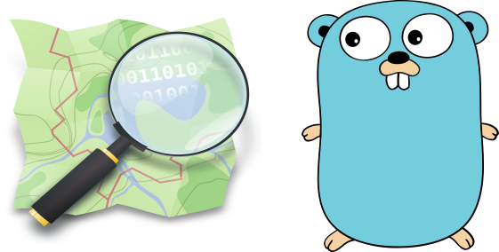

<p align="center">
  
</p>

# go-osm

[](https://pkg.go.dev/github.com/georacle-labs/go-osm)
[](https://goreportcard.com/report/github.com/georacle-labs/go-osm)
[](https://circleci.com/gh/georacle-labs/go-osm/tree/main)
[](https://dsc.gg/georacle)

The Go Client for [OpenStreetMap](https://www.openstreetmap.org/).

This package provides an open source framework for **location search** and **geocoding** using the OpenStreetMap dataset.

# Usage

```go
package main

import (
        "fmt"
        "log"

        "github.com/georacle-labs/go-osm/nominatim"
        "github.com/georacle-labs/go-osm/overpass"
)

func main() {
        // location query
        Tags := overpass.Tags{Key: "leisure", Value: "park"}
        a := &overpass.Area{Name: "London", Tags: Tags}
        location, err := a.Query("https://overpass-api.de/api/interpreter")
        if err != nil {
                log.Fatal(err)
        }
        fmt.Println(location)

        // geocode
        g := &nominatim.GeocodeQuery{Address: "221B Baker St, London NW1 6XE, UK"}
        geocode, err := g.Query("https://nominatim.openstreetmap.org/")
        if err != nil {
                log.Fatal(err)
        }
        fmt.Println(geocode)
}
```

# Backends

| Package                                                                                          | Functionality                                                                                            |
|------------------------------------------------------------------------------------- |----------------------------------------------------------------------------------------------|
| [Nominatim](https://github.com/osm-search/Nominatim)  | Fuzzy search, Geocoding, Reverse Geocoding                                  |
| [Overpass](https://github.com/drolbr/Overpass-API)           | Location search by named area, bounding box, and proximity     |


# License

The source code is available under an MIT license

# Contributing

Contributions, bug reports and pull requests are welcome.

In general, we follow the **fork-and-pull** Git workflow:

 1. **Fork** the repo on GitHub
 2. **Clone** the project to your own machine
 3. **Commit** changes to your own branch
 4. **Push** your work back up to your fork
 5. Submit a **Pull request**

Note: Be sure to merge the latest from "upstream" before making a pull request

# Questions and Help

For questions, community help and discussions use one of the following

- [Discord](https://dsc.gg/georacle)
- [GitHub Issues](https://github.com/georacle-labs/go-osm/issues)
